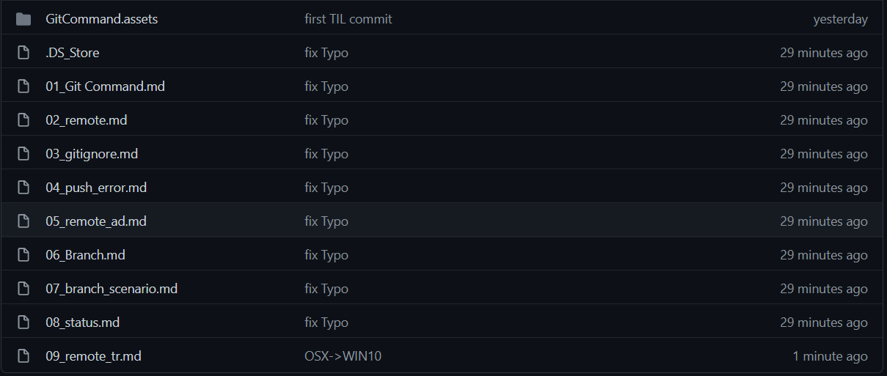

### 원격저장소 실습

> 맥북 => 윈도우 데스크탑

### git bash 설치

* 이미 설치가 되있었다 -> 멋모르고 설치한 것으로 추정

### Clone

- 원격 저장소를 복제

```bash
$ git clone https://github.com/ondue/TIL.git
Cloning into 'TIL'...
remote: Enumerating objects: 46, done.
remote: Counting objects: 100% (46/46), done.
remote: Compressing objects: 100% (33/33), done.
remote: Total 46 (delta 9), reused 46 (delta 9), pack-reused 0
Unpacking objects: 100% (46/46), done.
```

- 해당 폴더로 이동 및 사용자 설정

```bash
$ git config --global user.email "ondue@kakao.com"
$ git config --global user.name "ondue"
$ git config --global -l
user.email=ondue@kakao.com
user.name=ondue
```

### 추가해보기

* 원격저장소 실습 내용을 저장하는 파일 생성

```bash
$ touch 09_remote_tr.md
```

* 해당 내용까지 저장 후 push

```bash
$ git add 09_remote_tr.md
$ git commit -m "OSX->WIN10"
$ git push origin master
```

### 결과 확인



### 느낀점

- 형상관리에 대해서 어렵다고만 생각했는데 여전히 어렵다.
- 하지만 재밌다.
- 익숙해지기 위해서 TIL을 열심히 가꾸어야겠다.
- 다시 push하고 맥북에서 `pull` 해야되는 것.. 잊지말자..오히려 좋아

### 추가

* OMG.. md 파일만 올리고 이미지 파일을 안올렸다. 다시